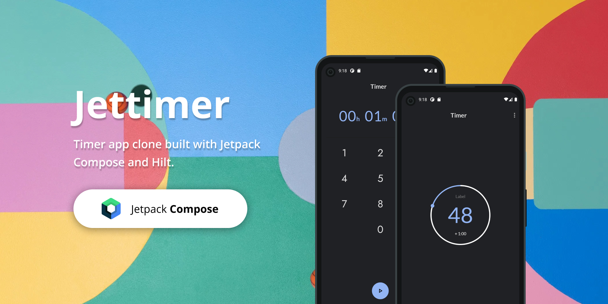
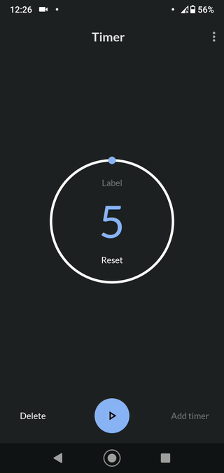
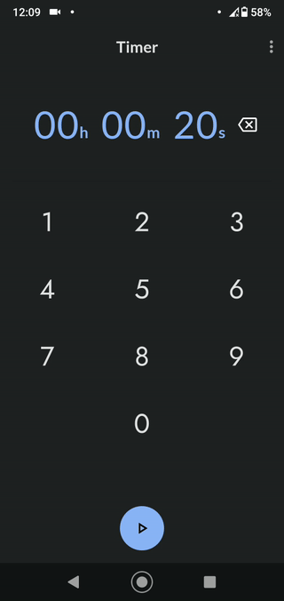
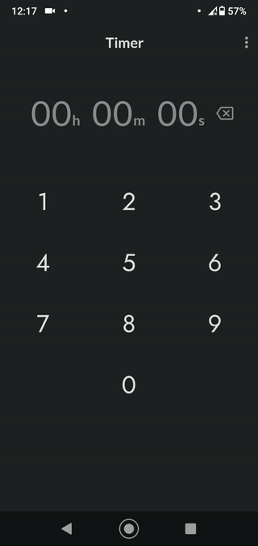

# Jettimer

[](https://kotlinlang.org)
[](https://developer.android.com/jetpack/compose)

## What's Jettimer? :hourglass_flowing_sand:
Timer app clone built with Jetpack Compose and Hilt.
The purpose of this project is to try new Android technologies and learn how it works in an app.

## Motivation and Context
Make Your Own Animation. It's so Easy!

 ProgressWithThumb | Transition | Visibility
--- | --- | --- |
Canvas-AnimateFloatAsState<br/>  | AnimatedVisibility<br/> | AnimatedVisibility<br/>


## Features  👓

The codebase focuses on following key things:

- Single Activity Design
- Clean and Simple UI 🎨
- Jetpack Compose UI
- Canvas - Jetpack Compose
- Notifications
- Services
- Broadcast receivers


## Screenshots ✨
&emsp;&emsp;

## Libraries and tools 🛠

- [Kotlin](https://kotlinlang.org/) - First class and official programming language for Android development.
- [Coroutines](https://kotlinlang.org/docs/reference/coroutines-overview.html) - For asynchronous and more..
- [Android Architecture Components](https://developer.android.com/topic/libraries/architecture) - Collection of libraries that help you design robust, testable, and maintainable apps.
  - [ViewModel](https://developer.android.com/topic/libraries/architecture/viewmodel) - Stores UI-related data that isn't destroyed on UI changes.
  - [LiveData](https://developer.android.com/topic/libraries/architecture/livedata) - LiveData is an observable data holder class. Unlike a regular observable, LiveData is lifecycle-aware.
- [Navigation Component](https://developer.android.com/guide/navigation/navigation-getting-started) Navigation refers to the interactions that allow users to navigate across, into, and back out from the different pieces of content within your app.
- [Dependency Injection](https://developer.android.com/training/dependency-injection) -
  - [Hilt-Dagger](https://dagger.dev/hilt/) - Standard library to incorporate Dagger dependency injection into an Android application.
  - [Hilt-ViewModel](https://developer.android.com/training/dependency-injection/hilt-jetpack) - DI for injecting `ViewModel`.
- [Jetpack Compose UI Toolkit](https://developer.android.com/jetpack/compose) - Modern UI development toolkit.
- [Accompanist](https://chrisbanes.github.io/accompanist/) - A collection of extension libraries for Jetpack Compose.
- [Spotless](https://github.com/diffplug/spotless) - Keep your code spotless.
- [EventBus](https://greenrobot.org/eventbus/) - EventBus is an open-source library for Android and Java using the publisher/subscriber pattern for loose coupling.

## License
```
Copyright 2020 The Android Open Source Project

Licensed under the Apache License, Version 2.0 (the "License");
you may not use this file except in compliance with the License.
You may obtain a copy of the License at

    https://www.apache.org/licenses/LICENSE-2.0

Unless required by applicable law or agreed to in writing, software
distributed under the License is distributed on an "AS IS" BASIS,
WITHOUT WARRANTIES OR CONDITIONS OF ANY KIND, either express or implied.
See the License for the specific language governing permissions and
limitations under the License.
```